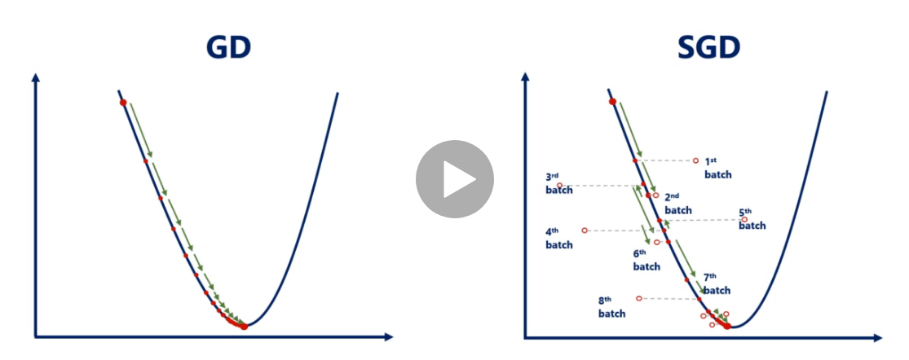

# Inicio
- [Bases](#bases)
    + [Variables](#variables)
- [Regresion Lineal](#regresion-lineal)
    + [Descomposicion Cholesky o LU](#descomposicion-cholesky-o-lu)
    + [Rateos de aprendizaje](#rateos-de-aprendizaje)
    + [Regresion Lineal Deming](#regresion-lineal-deming)
- [Regresion Logistica](#regresion-logistica)
- [SVM](#svm)
<small><i><a href='http://ecotrust-canada.github.io/markdown-toc/'>Table of contents generated with markdown-toc</a></i></small>

# Instalacion

INstaacion **Tensorflow 2.0**
```sh
conda create --name py3-TF2.0 python=3
conda activate py3-TF2.0
conda install tensorflow
pip install --upgrade tensorflow
pip install ipykernel
```

# Bases
<br />
Introduce el concepto de TPU (Tensor Processing Units) que mejora la performance<br />
<br />

**Se enfoca en redes neuronales**<br />
TensorFlow es mejor para redes neuronales que scikit learn<br />
TF introduce en nuevas versiones a Keras, en el 2015 era muy complejo y tenia una curva de aprendizaje complicada<br />
TensorFlow 2 es basicamente Keras, toma lo mejor de Keras y TF1<br />
Tensorflow no maneja los datos en xlsx o csv, porque necesita manejarlo como tensores, en multiple dimensiones, una solucion es NPZ files<br />
Existen 11 pasos:
- Importación o generación del conjunto de datos.
- Transformación y normalización de los datos.
- Dividir el conjunto de datos en conjunto de entrenamiento, de validación y de test.
- Definir los hiperparámetros del algoritmo
- Inicializar variables y placeholders
- Definir la estructura del modelo del algoritmo.
- Declarar la función de pérdidas (loss function)
- Inicializar y entrenar el modelo anterior.
- Evaluación del modelo
- Ajustar los hiper parámetros
- Publicar (subir a producción) y predecir nuevos resultados
```py

x = tf.constant(30) # Constante

 # variable, float32, siempre vectores de 3 coordenadas x,y,z
x_input = tf.placeholder(tf.float32, [None, 3]) # vectores de 3
y_input = tf.placeholder(tf.float32, [None, 5]) # vectores de 5

# add -> sumar
# multiply -> multiplicar
y_pred = tf.add(tf.multiply(m_matrix, x_input), n_vector)

# Rellena con ceros 3 filas, 4 columnas y 6 de profundidad
zero_t = tf.zeros([3, 4, 6])

# Relleno con 1988
filled_t = tf.fill([4,5,2], 1988)

# Vector de ceros con el mismo tamaño que cte_t
zero_sim = tf.zeros_like(cte_t)

# Vector de uno con el mismo tamaño que cte_t
ones_sim = tf.ones_like(cte_t)
```


### Variables

```py
# Convertir a variable
tf.Variable(rand_norm_t)

# Convertir a tensor
tf.convert_to_tensor(1988)
```

# Regresion Lineal

At * A -> Siempre da una matriz cuadrada<br />

De todas las rectas posibles cual es la que minimiza mas la distancia<br />
<br />

### Regresion Lineal Multiple
<br />
<br />

### Descomposicion Cholesky o LU
El problema esta cuando hay matrices muy grandes, eso nos ayuda a tener mayo eficiencia que el <br />
$$x = (A^TA)^{-1}A^Tb$$ <br />
Obtener un conjunto de matrices a partir de una matriz y operar con ellas, aca es donde viene LU<br />
<br />

### Rateos de aprendizaje
<br />

### Regresion Lineal Deming
Lo que lo diferencia de la RL es la tecnica que utilizareos,
minimizaermos la proyeccion con respecto a la recta, minimizamos la recta en perpendicular, **NO MINIMIZA EL ERROR EN Y, MINIMIZA EL ERROR TANTO EN X COMO EN Y**<br />
<br />

# Regresion Logistica
Probabilidad de pertenecer a un conjunto de datos, es si o no<br />

# SVM
Seria lo que engloba la parte de la linea de la regresion, separaremos distancia entre las categorias para minimizar el error<br />
<br />

# Modelo

## Entrenamiento
Utilizaremos la funcion de optimizacion y la funcion de coste. <br />
Como funcion de optimizacion utilizaremos SGD (Stochastic gradient descent)
```py
custom_optimizer = tf.keras.optimizers.SGD(learning_rate=0.02)
```
Como funcion de perdida utilizaremos el error medio de cuadrados
```py
model.compile(optimizer=custom_optimizer, loss='mean_squared_error')
```
Entrenaremos el modelo:
```py
model.fit(training_data['inputs'], training_data['targets'], epochs=100, verbose=2)
```
Con **verbose** indicamos:<br/>
- con 0 que sea en silencio, sin mostrar nada
- con 1 mostramos una barra de progreso
```sh
Epoch 1/100
32/32 [==============================] - 0s 553us/step - loss: 23.0959
Epoch 2/100
32/32 [==============================] - 0s 741us/step - loss: 1.1450
Epoch 3/100
32/32 [==============================] - 0s 788us/step - loss: 0.3997
```
- con 2 muestra una linea por epoch
```sh
Epoch 1/100
32/32 - 0s - loss: 29.4114
Epoch 2/100
32/32 - 0s - loss: 1.2601
Epoch 3/100
32/32 - 0s - loss: 0.4172
```

## Prediccion
Para predecir podemos utilizar **predict_on_batch**
```py
model.predict_on_batch(training_data['inputs'])
```
## Plot de datos
POdemos visualizar que tanto se alejan las predicciones de los targets
```py
plt.plot(np.squeeze(model.predict_on_batch(training_data['inputs'])), np.squeeze(training_data['targets']))
plt.xlabel('outputs')
plt.ylabel('targets')
plt.show()
```


# Deep Learning
 
## Hyper parametros
Para redes neuronales<br />
En lugar de trabajar con Weights (w) y Biases (b), trabajaremos con: 
- Width: alto de las nn, por lo general siempre es la misma por capa
- Depth: Profundidad de las nn 
- Learning date: rateo de aprendizaje

# Activation Function

<br />

## Softmax
<br />
<br />

# Gradient Descent

### Stochastic Gradient Descent
<br />


### Momentum
Utilizamos para conocer cual es el punto mas bajo<br />
<br />

### Aram
<br />
<br />
<br />