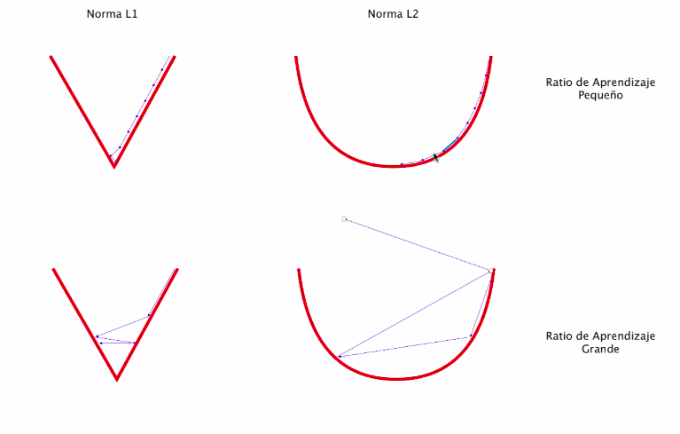

# Inicio


# Bases

Existen 11 pasos:
- Importación o generación del conjunto de datos.
- Transformación y normalización de los datos.
- Dividir el conjunto de datos en conjunto de entrenamiento, de validación y de test.
- Definir los hiperparámetros del algoritmo
- Inicializar variables y placeholders
- Definir la estructura del modelo del algoritmo.
- Declarar la función de pérdidas (loss function)
- Inicializar y entrenar el modelo anterior.
- Evaluación del modelo
- Ajustar los hiper parámetros
- Publicar (subir a producción) y predecir nuevos resultados
```py

x = tf.constant(30) # Constante

 # variable, float32, siempre vectores de 3 coordenadas x,y,z
x_input = tf.placeholder(tf.float32, [None, 3]) # vectores de 3
y_input = tf.placeholder(tf.float32, [None, 5]) # vectores de 5

# add -> sumar
# multiply -> multiplicar
y_pred = tf.add(tf.multiply(m_matrix, x_input), n_vector)

# Rellena con ceros 3 filas, 4 columnas y 6 de profundidad
zero_t = tf.zeros([3, 4, 6])

# Relleno con 1988
filled_t = tf.fill([4,5,2], 1988)

# Vector de ceros con el mismo tamaño que cte_t
zero_sim = tf.zeros_like(cte_t)

# Vector de uno con el mismo tamaño que cte_t
ones_sim = tf.ones_like(cte_t)
```


### Variables

```py
# Convertir a variable
tf.Variable(rand_norm_t)

# Convertir a tensor
tf.convert_to_tensor(1988)
```

# Regresion Lineal

At * A -> Siempre da una matriz cuadrada<br />

De todas las rectas posibles cual es la que minimiza mas la distancia<br />
<br />

### Descomposicion Cholesky o LU
El problema esta cuando hay matrices muy grandes, eso nos ayuda a tener mayo eficiencia que el <br />
$$x = (A^TA)^{-1}A^Tb$$ <br />
Obtener un conjunto de matrices a partir de una matriz y operar con ellas, aca es donde viene LU<br />
<br />

### Rateos de aprendizaje
<br />

### Regresion Lineal Deming
Lo que lo diferencia de la RL es la tecnica que utilizareos,
minimizaermos la proyeccion con respecto a la recta, minimizamos la recta en perpendicular, **NO MINIMIZA EL ERROR EN Y, MINIMIZA EL ERROR TANTO EN X COMO EN Y**<br />
<br />

# Regresion Logistica
Probabilidad de pertenecer a un conjunto de datos, es si o no<br />